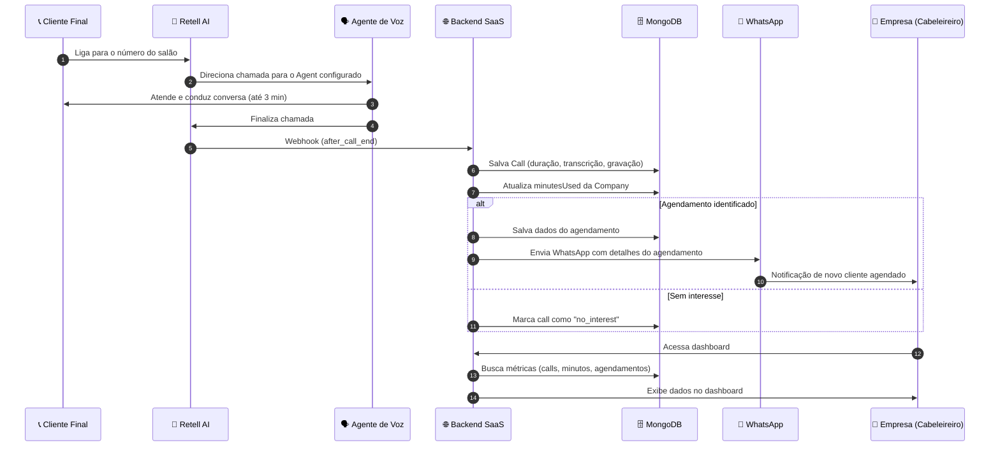

```mermaid
sequenceDiagram
    autonumber

    participant Cliente as 📞 Cliente Final
    participant Retell as 🤖 Retell AI
    participant Agent as 🗣️ Agente de Voz
    participant API as 🌐 Backend SaaS
    participant DB as 🗄️ MongoDB
    participant WPP as 💬 WhatsApp
    participant Biz as 💈 Empresa (Cabeleireiro)

    Cliente->>Retell: Liga para o número do salão
    Retell->>Agent: Direciona chamada para o Agent configurado
    Agent->>Cliente: Atende e conduz conversa (até 3 min)

    Agent->>Retell: Finaliza chamada
    Retell->>API: Webhook (after_call_end)

    API->>DB: Salva Call (duração, transcrição, gravação)
    API->>DB: Atualiza minutesUsed da Company

    alt Agendamento identificado
        API->>DB: Salva dados do agendamento
        API->>WPP: Envia WhatsApp com detalhes do agendamento
        WPP->>Biz: Notificação de novo cliente agendado
    else Sem interesse
        API->>DB: Marca call como "no_interest"
    end

    Biz->>API: Acessa dashboard
    API->>DB: Busca métricas (calls, minutos, agendamentos)
    API->>Biz: Exibe dados no dashboard
```
